## DB Zapateria

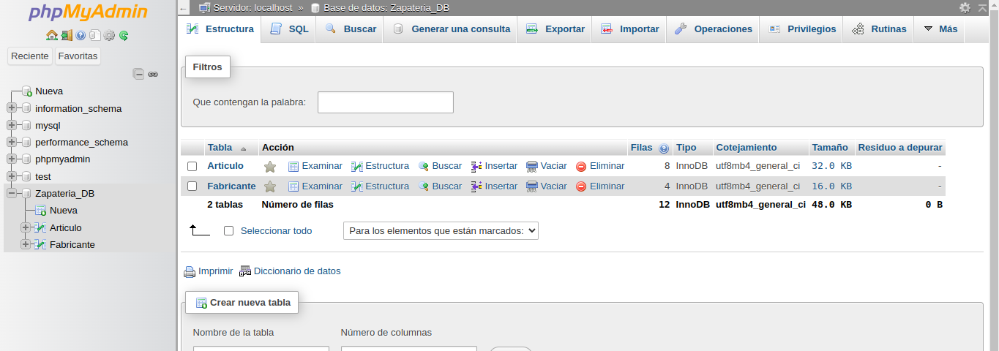
## Tabla Articulo
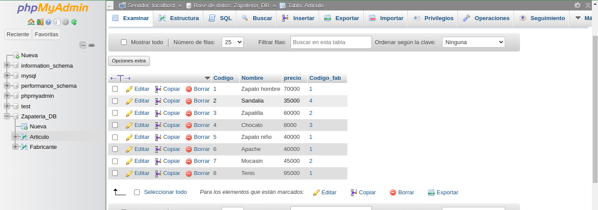
## Tabla Fabricantes
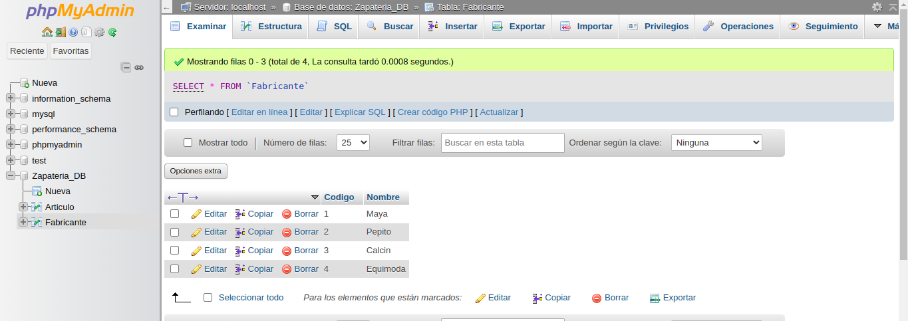

## Relaciones Tablas

## Obtener los nombres de los productos de la Zapateria
SELECT nombre FROM Articulo;
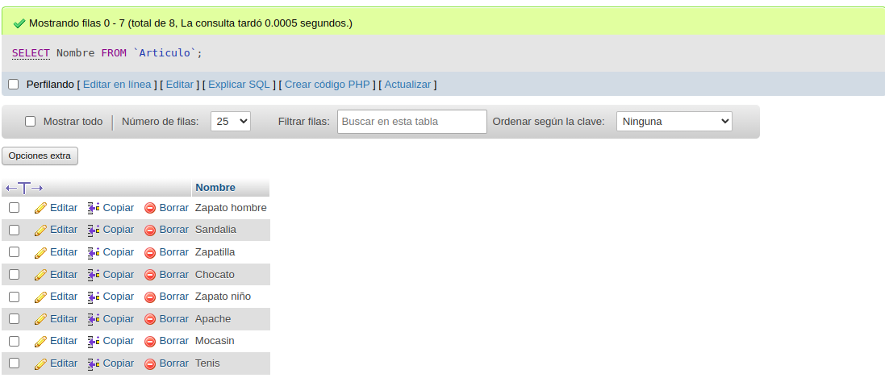

## Obtener los nombres y los precios de los productos de la Zapatería.
SELECT Nombre,precio FROM Articulo;
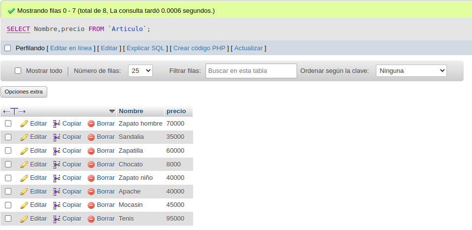

## Obtener el nombre de los productos cuyo precio sea menor o igual a 50000
SELECT nombre,precio FROM Articulo WHERE precio <= 50000;
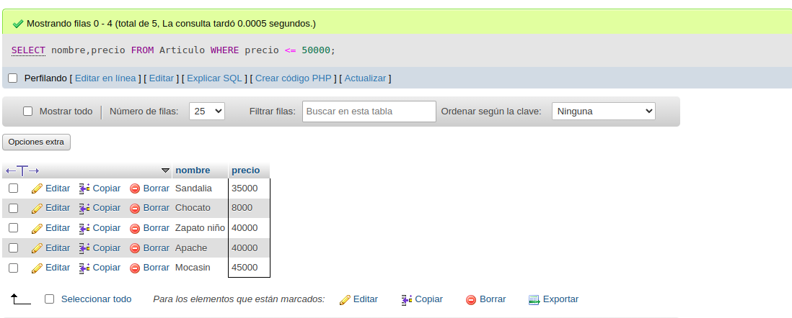

## Obtener todos los datos de los artículos cuyo precio esté entre 5000 y 40000 (ambas canditades incluidas)
SELECT * FROM Articulo WHERE precio BETWEEN 5000 AND 40000;
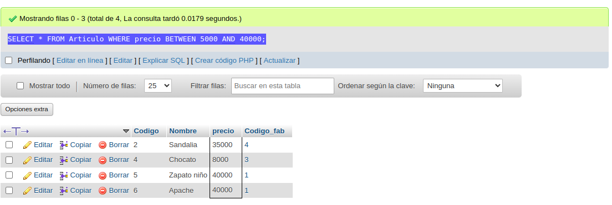

## Obtener el nombre y el precio de cada artículo, en dolares.
SELECT nombre, precio / 4231 AS precio_en_dolares FROM Articulo;
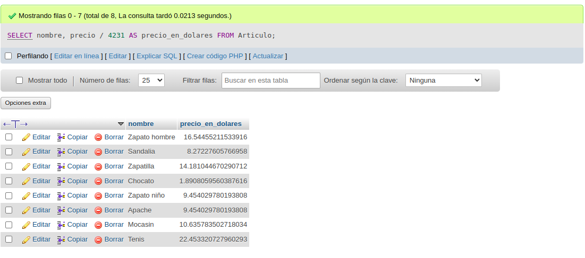

## Obtener el precio promedio de todos los artículos
SELECT AVG(precio) as precio_promedio FROM Articulo;
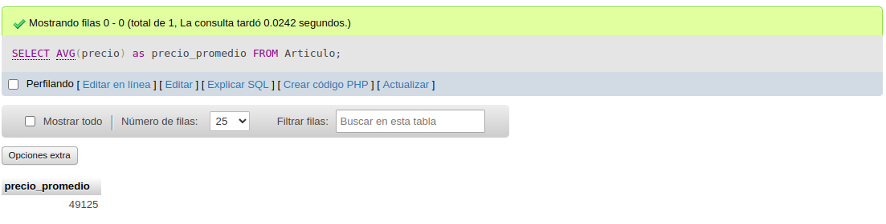

## Obtener el precio medio de los artículos cuyo codigo de fabricante sea 2.
SELECT AVG(precio) as precio_medio FROM Articulo WHERE Codigo_fab = 2;
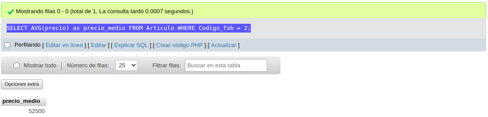

## Obtener el número de artículos cuyo precio sea mayor o igual a 50000
SELECT COUNT(*) as cantidad_articulos FROM Articulo WHERE precio >= 50000;
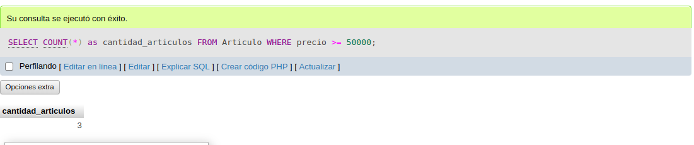

## Obtener el nombre y precio de los artículos cuyo precio sea mayor o igual a 50000 y ordenarlos descendentemente por precio, y luego ascendentemente por nombre.
SELECT Nombre,precio FROM Articulo WHERE precio >=50000 ORDER BY precio DESC, Nombre ASC;
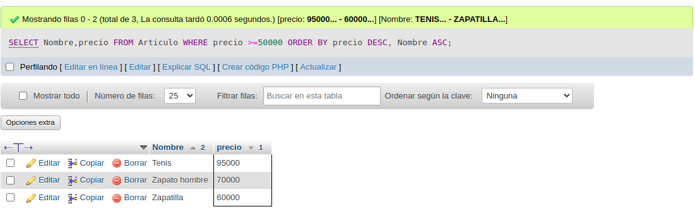

## Obtener un listado completo de artículos, incluyendo por cada articulo los datos del artículo y de su fabricante.